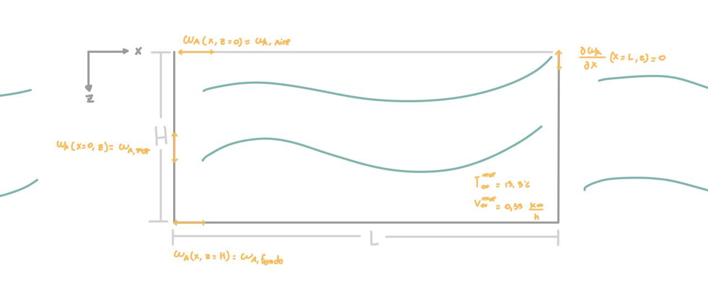

# IIQ2003-ProyectoG15

## Contexto y problemática

En Chile, el salmón representa el segundo producto de exportación más relevante del país, siendo la principal industria en la zona sur del país (desde la Región de la Araucanía a  Magallanes). Según el Instituto Nacional de Estadísticas (INE), en el primer semestre de 2025, un 78,1% de las exportaciones regionales de Chile corresponden a productos derivados del selmón, alcanzando un total de 3.000 millones de dólares (INE, 2025) de ganancias. Dentro de esta zona, los centros de producción más relevantes de esta industria se ubican en Puerto Montt (Región de Los Lagos) y en diversos canales en la Región de Aysén.

Existen diversas condiciones asociadas a la temperatura, movimiento y concentraciones en el agua que deben considerarse, por lo que es revelante estudiar y comprender los procesos de transferencia de propiedades como calor, momentum y masa generados en el sistema (en este caso el mar) que permiten el desarrollo de esta importante industria para el país (Consejo del Salmón, 2025).

Sin embargo, en los últimos años, la Organización de las Naciones Unidas para la Educación, la Ciencia y la Cultura (UNESCO) ha alertado sobre la creciente acidificación de los océanos, debido principalmente a un aumento de la concentración de dióxido de carbono ($CO_2$) disuelto en el agua (UNESCO, 2024). Esto, junto con la generación de 1,4 toneladas de lodo ligada a la producción de una tonelada de salmón, constituyen los principales desafíos medioambientales de la industria salmonera, perjudicando el desarrollo de esta especie (Comité Científico de Investigaciones Oceánicas et al., 2008).

Este proyecto tiene como objetivo implementar un modelo de transferencia de masa mediante modelación teórica-matemática y computacional, permitiendo la optimización de la disponibilidad de oxígeno en una jaula de salmones y reducir el impacto ambiental y mejorar la destinación de recursos en esta industria. Los datos utilizados corresponden a propiedades de las salmoneras ubicadas en Puerto Montt, Región de Los Lagos, Chile.

## Características del modelo

En este modelo, se estudia la transferencia de masa de oxígeno ($O_2$) dentro de una jaula salmonera cuadrada sumergida en agua de mar, la cual corresponde al sistema del modelo. Este sistema es además replicable para todas las jaulas presentes en una planta salmonera en Puerto Montt.

### Supuestos del modelo

* 
* Se considera estado estacionario, por lo que no existe variación de concentración respecto al tiempo.
* Se tiene un sistema bidimensional, donde existe transferencia de masa en las direcciones $x$ y $z$. No hay velocidad ni variaciones en el eje $y$.
* La tasa de adición de oxígeno es $0$, por lo que $\alpha$ se anula.
* Se modelará sólo una jaula con dimensones $30$ m (largo) x $30$ m (ancho) x $15$ m (profundidad)). Modelar más de una jaula es considerablemente más complejo, ya que una jaula puede recibir agua parcialmente desoxigenada al pasar por las jaulas aguas arriba (Alver et al., 2024).
* Se considera una distribución normal de los salmones en la jaula. Hay que destacar que puede ser fuente de imprecisiones.
* Cada salmón tiene una velocidad de $U$.
* Cada salmón tiene un peso $P$ = $3$ kg (SalmonChile,s.f.) 
* Se considera que el salmón siempre está en movimiento y con velocidad constante.
* Condiciones dentro de la jaula: Constantes físicas se mantienen, $\rho$ (densidad agua), $\mu$ (viscosidad) y $p$ (presión agua).
* Condiciones del mar constantes: temperatura de $T^{mar}_{\infty}$= $13.3$ °C y una velocidad de $0.35$ km/h o $0.0972$ m/s (Mar y Oleaje - Meteoblue, s. f.).
* La concentración inicial se asume igual a $0$.
* Para la difusión de oxígeno en agua a $13$ °C, se puede estimar que el coeficiente de difusión es de $2*10^{-9}$ m^2/s (Rahlff et al., 2019).
* La concentración de oxígeno en el mar es de 6,5 mL/L aproximadamente (rango de 5-8 mL/L), que transformando usando el volumen molar de un gas ideal, se obtiene que es 0,29 mol/m^3  (Silva, 2006, p. 37).
* La concentración de oxígeno en la interfase aire-agua se estima en $0.329$ mol/m^3 (U.S. Geological Survey, 2018)).
* La concentración de oxígeno en el fondo se asume mayor que en la interfase, ya que se asume mayor riqueza de oxígeno por biodiversidad, por lo que se asume en $1$ mol/m^3.

### Condiciones de borde

* **Condición de borde 1**: La concentración de oxígeno en la interfase aire-agua será la concentración del aire.

  $\omega_A(x, z=0)=\omega_{A,aire}$

* **Condición de borde 2**: El gradiente de la concentración de oxígeno en el costado derecho de la jaula es $0$.

  $\omega_{Ax}(x=L,z)=0$

* **Condición de borde 3**: La concentración de oxígeno al final de la jaula, se considera que es un valor conocido, debido a que se sabe que la biodiversidad del mar genera este mismo.

  $\omega_A(x,z=H)=\omega_{A,fondo}$

* **Condición de borde 4**: La concentración de oxígeno en el costado izquierdo de la jaula se conoce, se estima que es la concentración de oxígeno en el mar.

  $\omega_A(x=0,z)=\omega_{A,mar}$

En la siguiente figura, se tiene un esquema que sintetiza algunos de los supuestos y condiciones de borde descritas anteriormente:

### Método numérico del modelo

A partir de diversas fuentes e investigaciones, se determinó utilizar la ecuación de advección-difusión y un modelo del consumo de oxígeno del salmón para estimar la distribución espacial del oxígeno, donde la variable de estado $\omega(x, y, z, t)$ representa la concentración de oxígeno disuelto en mg/L, siendo esta la más empleada en diversos papers. 

$\frac{\partial\omega}{\partial t}+V_x\frac{\partial\omega}{\partial x}+V_y\frac{\partial\omega}{\partial y}+V_z\frac{\partial\omega}{\partial z}+\kappa_h(\frac{\partial^2\omega}{\partial x^2}+\frac{\partial^2\omega}{\partial y^2})+\kappa_v\frac{\partial^2\omega}{\partial z^2}=\alpha-\sigma$

Considerando que se desprecian los efectos en el eje $y$, la expresión se reduce a la siguiente:

$\frac{\partial\omega}{\partial t}+V_x\frac{\partial\omega}{\partial x}+V_z\frac{\partial\omega}{\partial z}+\kappa_h\frac{\partial^2\omega}{\partial x^2}+\kappa_v\frac{\partial^2\omega}{\partial z^2}=\alpha-\sigma$

$V_x(x,y,z)$ y $V_z(x,y,z)$ corresponden a las componentes horizontal y vertical del vector de corriente, $\kappa_h$ y $\kappa_v$ son los coeficientes de difusión horizontal y vertical para DO, $α(x, y, z, t)$ la tasa de adición de oxígeno y $σ(x, y, z, t)$ la tasa de consumo de oxígeno.

Para determinar  κh y κv, en la práctica dependen de diversos factores. Sin embargo, por simplicidad, se considera  κh = κv = κ , lo cual es un modelo razonable (Alver et al., 2022). 

Para nuestro modelo, κ corresponde al coeficiente de difusión de oxígeno en el mar a la respectiva temperatura.

Para modelar la tasa de consumo de oxígeno, σ(x, y, z, t), se debe considerar el consumo de oxígeno, VO2, y la distribución de los peces, β.
VO2=0.0171P-0,331.03T1.79U

Donde P es el peso corporal (kg), T es la temperatura del agua (°C) y U es la velocidad de nado (longitudes corporales por segundo). Se considera U con un valor de 2.2 longitudes corporales por segundo, el valor más bajo contabilizado por Alver et al. (2022). 

La población, distribuida normalmente, corresponde a solo un grupo para nuestro caso, donde hay un número de individuos (Nk) y un peso corporal individual medio (Wk) (Alver et al., 2022). 
σ(x, y, z, t)=VO2NkWk(x, y, z, t)

Se considera β(x, y, z, t) como la distribución relativa de los peces en el volumen de la jaula. Como consideramos que no hay alimentación, entonces es razonable considerar β, con VT el volumen total en la jaula (Alver et al., 2022):
NF(x, y, z, t) = 1VT

Por lo tanto, el modelo simplificado con nuestras condiciones, considerando estado estacionario, queda:

vxx+vzz+(2x2+2z2)=-VO2NkWk1VT

## Instrucciones de ejecución del modelo
